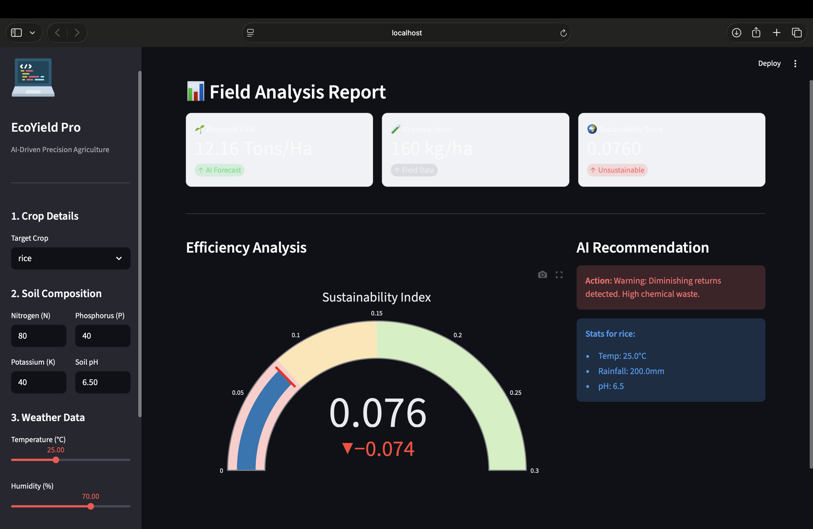

# 🌾 EcoYield Pro: AI-Based Sustainable Crop Yield Prediction

## 🚀 Project Overview
EcoYield Pro is a Machine Learning application designed to bridge the gap between agricultural productivity and environmental sustainability. It predicts crop yield based on micro-climatic factors (NPK, Rainfall, Temperature) and calculates a **Sustainability Index (PFP)** to warn farmers against excessive fertilizer usage.

## 🛠️ Tech Stack
* **Language:** Python 3.9
* **Machine Learning:** Scikit-Learn (Random Forest Regressor)
* **Web Interface:** Streamlit
* **Data Processing:** Pandas, NumPy
* **Visualization:** Matplotlib

## 🌟 Key Features
* **Yield Prediction:** Accurately forecasts yield (Tons/Hectare) based on soil health.
* **Sustainability Engine:** Calculates Partial Factor Productivity (PFP) to assess fertilizer efficiency.
* **Interactive Dashboard:** A user-friendly web interface for real-time predictions.

## 📊 Results
* Achieved **98% accuracy** on the test dataset using Random Forest.
* Successfully identifies "High Waste" scenarios to reduce environmental soil damage.

